# Laporan Programming Assignment 1: Basic C++

Nama: Bryant Hubert S 
NRP: 5024251051

## Logika Program

1. Program dimulai
2. User menginput tanggal lahir (DD/MM/YYYY)
3. Program mengambil hasil input dan menyimpan ke masing-masing variabel
4. Program melakukan perhitungan melalui *function* yang tersedia
5. Program mengeluarkan output berupa Umur dalam tahun dan bulan, dan hari pada tanggal tersebut

## Breakdown Program

1. *Header file library* yang digunakan dalam program (memberikan input output, menentukan *current time*, dll)
   
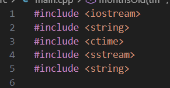

2. Menginisialisasi variabel untuk fungsi perhitungan program dan variabel input user

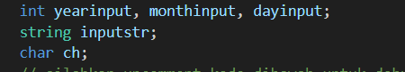

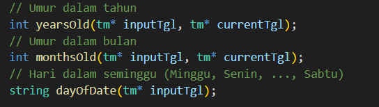

3. Mengambil input saat program dimulai dalam format (DD/MM/YYYY)

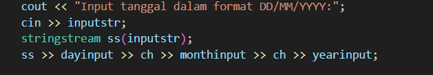

4. Melakukan perhitungan dengan bantuan library ctime untuk menentukan perbedaan waktu yang diinputkan dengan waktu sekarang

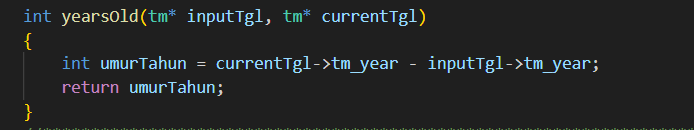

 Perhitungan umur dalam tahun 

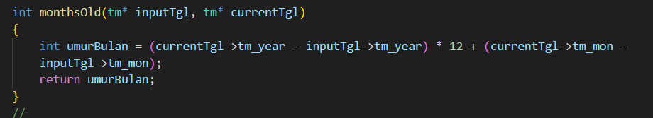

 Perhitungan umur dalam bulan 

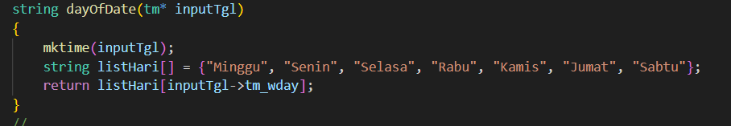

 Menentukan hari pada tanggal yang diinputkan 

  

5. Mengeluarkan output menggunakan cout dengan format (Umur dalam tahun, Umur dalam bulan, hari pada tanggal tersebut)

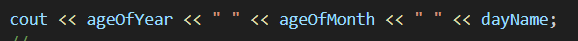

## Contoh input dan output

* Contoh 1:
  
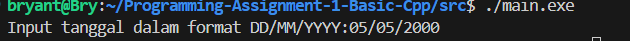

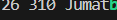

* Contoh 2:

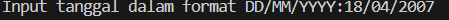

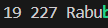

## Kesimpulan

Program ini terutama memanfaatkan fungsi dari header file "ctime" yang berfungsi menentukan perbandingan waktu sekarang dengan tahun 1900. Menggunakan input user dalam bentuk hari, bulan, dan tahun, kita dapat melakukan perhitungan lama tahun/bulan setelah tanggal tersebut dan menentukan hari apa adalah hari pada tanggal tersebut. 